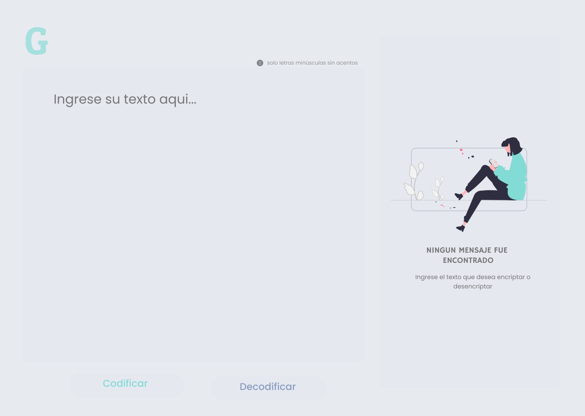

# Encriptador de texto

Pequeño encriptador de texto correspondiente a Sprint 01: Challenge Oracle One con UI inspirada en Neumorphism Design.
<div>
<br> 
<p style = 'text-align:center;'>

</p>
</div>

## Cifrado
El cifrado de cada palabra corresponde a distintas equivalencias para cada vocal.

```javascript
const vowels = {    
    "a" : "ai",
    "e" : "enter",
    "i" : "imes",
    "o" : "ober",
    "u" : "ufat" };
```
Haciendo uso de la función ```replace()``` y expresiones regulares se realiza la codificación y decodificación del texto.

